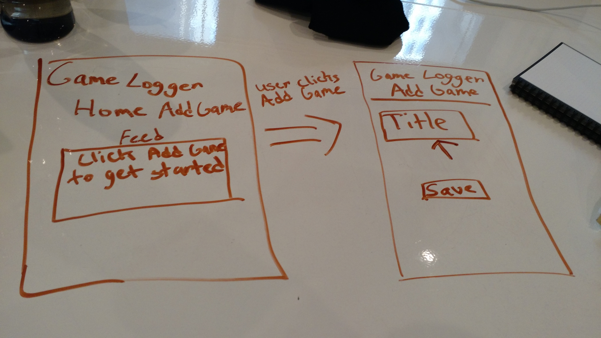
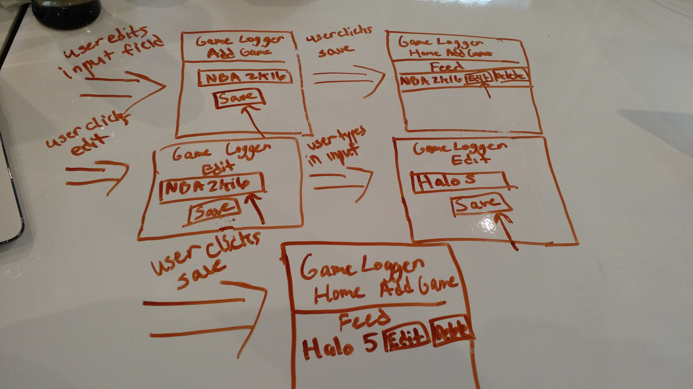

#Game Log App


###[Link to game](http://messenger-ferret-81632.bitballoon.com/)
---
##Technologies Used:
- HTML
- CSS
- Vanilla javascript
- jquery
- React.js
- react-router
- Bootstrap
- Firebase
- axios
---
##Installation Instructions

- Download folder.
- Run npm install in terminal.
- Run npm start from terminal.
- Or go to build folder and Double click on index.html to run the game


---
##Sample Code: Printing Game Stats
```javascript

printStats(key) {
  return (
    Object.keys(this.state.titles).map( (data) => {
      return (
      <li>
        <p>{this.state.titles[data]['title']}</p>
        <p>{this.state.titles[data]['description']}</p>
        <button  onClick={ ()=> this.deleteStat(data) }>Delete</button>
        <button onClick={ ()=> this.editStat(data) }>Edit</button>

      </li>
    )
    })
)
}
```
---
##Build Strategy
```
React.js:

  1. Create UI by using JSX.
  2. Create Game list item that is appended to Firebase database.
  3. Print Game List Item in the feed section of the homepage.
  4. Render Game List Item w/ an edit and delete button.
  5. Edit button will do a post request to firebase, delete button will perform a delete request.

JavaScript/jQuery/axios:
  1. Incorporate into React.
  2. Use jQuery to simplify selecting elements.
  3. Create functions to edit and delete Game List items from firebase.
  4. Perform a GET, Post, and delete request to firebase database using axios.

BootStrap:
  1. Style the app using css provided by bootstrap.

```  
---
##Project Outline/Wireframe


[User Stories - Trello](https://trello.com/b/R4mSObNh/game-log-app)

###Wireframe
Part 1

Part 2

Part 3


---
##Issues/Future Goals
###Issues:
- One issue I had was with breaking down components. I found myself reusing functions would could have easily been its own component.
- Another issue I had was with rendering elements using React. I was initially performing DOM manipulation outside of React, until I learned the proper way to render the elements.
- Passing down state was an issue. I did not hoist state up to a parent component that could then distribute it to child elements to share the data. Because of this I often had to keep fetching data to setState once again.

###Future Goals:
- Styling! Styling! Styling!
- I would like to hoist state up to better distribute the data to components that will use it.
- Would love to integrate an external API to fetch data pertaining to the Game that the user added.
- Will definitely want to play around with breaking down functions into separate components when the code is used multiple times.
#### For Version 2:
- Use Firebase API to allow for additional users - in progress
- Rebuild app to beter handle state - in progress
- Style w/ React Bootstrap


---
##Special Thanks

Special thanks to my IA, Paris for providing direction as well as my fellow classmates for helping me out with any questions I had along the way. Paris helped explain to me the importance of letting React handle DOM manipulation. I will definitely practice it more.

---
##Author

Dominic Farquharson
